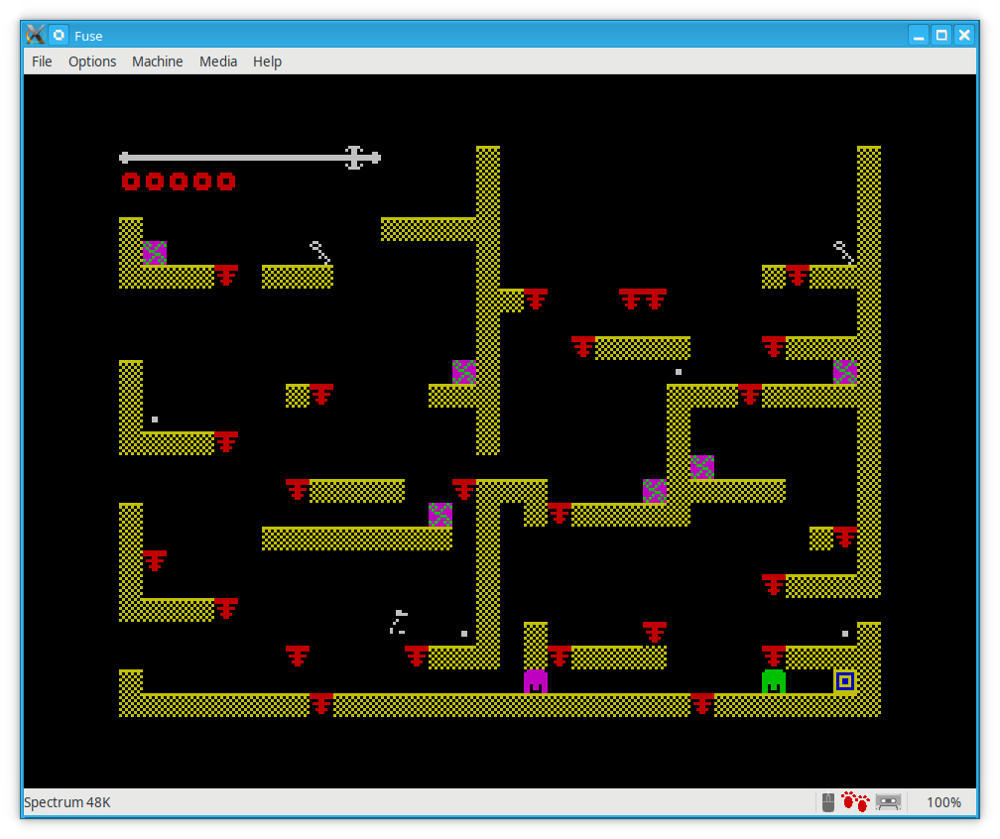

# ZX Wonky One Key

A game for the 48K ZX Spectrum home micro from the 1980s. The TAP file of
the latest release is [here](https://github.com/derekfountain/zxwonkyonekey/blob/master/src/Downloads/wonky_latest.tap).
Click that link, then click on "View Raw", and save as a TAP file. Then you
should be able to just drag and drop it onto your emulator window.

